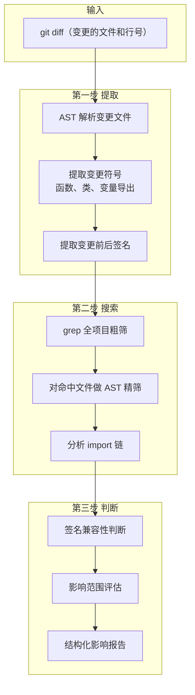

# 跨文件影响分析实现方案

> 属于严格审查的第二层，位于正则/AST 之后、LLM 审查之前。
> 目标：改了一个文件，自动找出所有受影响的其他文件，判断改动是否兼容。

---

## 一、总体流程



---

## 二、数据结构

### 2.1 ChangedSymbol — 被改动的符号

```python
# review_impact.py

from __future__ import annotations
import ast
import difflib
from dataclasses import dataclass, field
from pathlib import Path
from typing import Any


@dataclass
class FunctionSignature:
    """函数签名。"""
    name: str
    params: list[str]           # ["username: str", "password: str", "captcha: str | None = None"]
    required_params: list[str]  # ["username: str", "password: str"]
    optional_params: list[str]  # ["captcha: str | None = None"]
    return_type: str = ""       # "User | None"
    decorators: list[str] = field(default_factory=list)


@dataclass
class ChangedSymbol:
    """一次变更中涉及的一个符号。"""
    symbol_type: str               # "function" / "class" / "variable" / "method"
    name: str                      # 符号名
    file_path: str                 # 所在文件
    old_line_range: tuple[int, int] | None  # 改前行号范围
    new_line_range: tuple[int, int] | None  # 改后行号范围
    old_signature: FunctionSignature | None = None  # 改前的函数签名
    new_signature: FunctionSignature | None = None  # 改后的函数签名
    is_exported: bool = False      # 是否被其他文件 import（通过 import 分析得出）
    is_public: bool = True         # 是否公开（不以下划线开头）
    changed_lines: list[int] = field(default_factory=list)  # 具体改动的行号


@dataclass
class Reference:
    """一个引用位置。"""
    file_path: str
    line: int
    code: str                   # 引用的代码行内容
    context_before: list[str]   # 前 3 行上下文
    context_after: list[str]    # 后 3 行上下文
    import_path: str            # import 路径，如 "from auth import login"
    is_test_file: bool = False  # 是否在测试文件中


@dataclass
class CompatibilityIssue:
    """兼容性问题。"""
    symbol_name: str
    issue_type: str     # "missing_param" / "param_type_changed" / "return_type_changed" / "removed_export"
    severity: str       # "error" / "warning" / "info"
    description: str
    call_site: Reference


@dataclass
class CrossFileImpact:
    """跨文件影响分析的完整结果。"""
    changed_symbols: list[ChangedSymbol]
    references: list[Reference]
    affected_files: list[str]           # 受影响的文件去重列表
    compatibility_issues: list[CompatibilityIssue]
    safe_references: list[Reference]    # 确定安全的引用
    summary: str                        # 人类可读的总结
```

---

## 三、第一步：从 diff 中提取变更符号

### 3.1 解析 diff

```python
def extract_changed_symbols(file_path: str, old_content: str, new_content: str) -> list[ChangedSymbol]:
    """
    输入：改动前的内容 + 改动后的内容
    输出：被改动的符号列表

    流程：
    1. 分别解析 old 和 new 两版的 AST
    2. 提取两版中所有顶层定义（函数、类、模块级变量）
    3. 用 difflib.SequenceMatcher 比对两版
    4. 只返回有变动的符号
    """
    old_tree = ast.parse(old_content) if old_content else None
    new_tree = ast.parse(new_content)

    old_symbols = _extract_top_level_symbols(old_tree) if old_tree else {}
    new_symbols = _extract_top_level_symbols(new_tree)

    # 交集中的符号：检查签名是否变化
    # 差集中的符号：新增或删除

    changed = []
    all_names = set(old_symbols) | set(new_symbols)
    for name in all_names:
        old_sym = old_symbols.get(name)
        new_sym = new_symbols.get(name)

        if old_sym and new_sym:
            if _signatures_differ(old_sym, new_sym):
                # 找到具体改变的行
                old_lines = old_content.splitlines()
                new_lines = new_content.splitlines()
                changed_lines = _find_changed_lines(
                    old_lines, new_lines,
                    old_sym.lineno, old_sym.end_lineno,
                    new_sym.lineno, new_sym.end_lineno,
                )
                changed.append(ChangedSymbol(
                    symbol_type=old_sym.symbol_type,
                    name=name,
                    file_path=file_path,
                    old_signature=old_sym,
                    new_signature=new_sym,
                    changed_lines=changed_lines,
                ))
        elif new_sym and not old_sym:
            changed.append(ChangedSymbol(
                symbol_type=new_sym.symbol_type,
                name=name,
                file_path=file_path,
                new_signature=new_sym,
                changed_lines=list(range(new_sym.lineno, new_sym.end_lineno + 1)),
            ))
        # 删除的情况（old_sym exists, new_sym not）不在首次实现中处理

    return changed
```

### 3.2 AST 提取 top-level 符号

```python
def _extract_top_level_symbols(tree: ast.AST) -> dict[str, FunctionSignature]:
    """
    遍历 AST 顶层节点（非嵌套的），提取：
    - 函数定义 → FunctionSignature
    - 类定义 → 类的名称（方法级分析在第二步做）
    - 模块级变量 → 变量名
    """
    symbols = {}
    for node in ast.iter_child_nodes(tree):
        if isinstance(node, ast.FunctionDef):
            sig = _extract_function_signature(node)
            symbols[node.name] = sig
        elif isinstance(node, ast.AsyncFunctionDef):
            sig = _extract_function_signature(node)
            symbols[node.name] = sig
        elif isinstance(node, ast.ClassDef):
            # 类本身也作为符号，它的方法在引用分析中展开
            sig = FunctionSignature(
                name=node.name,
                params=[],
                required_params=[],
                optional_params=[],
                decorators=[ast.unparse(d) for d in node.decorator_list],
            )
            # 将类的方法也展平加入
            for item in node.body:
                if isinstance(item, (ast.FunctionDef, ast.AsyncFunctionDef)):
                    method_sig = _extract_function_signature(item)
                    method_sig.name = f"{node.name}.{item.name}"
                    symbols[f"{node.name}.{item.name}"] = method_sig
            symbols[node.name] = sig
    return symbols


def _extract_function_signature(node: ast.FunctionDef | ast.AsyncFunctionDef) -> FunctionSignature:
    """从 AST 节点提取完整的函数签名。"""
    args = node.args
    required = []
    optional = []
    all_params = []

    # 位置参数
    regular_count = len(args.args) - len(args.defaults)
    for i, arg in enumerate(args.args):
        arg_str = arg.arg
        if arg.annotation:
            try:
                arg_str += f": {ast.unparse(arg.annotation)}"
            except Exception:
                arg_str += ": ?"

        if i < regular_count:
            required.append(arg_str)
        else:
            default_idx = i - regular_count
            if default_idx < len(args.defaults):
                try:
                    arg_str += f" = {ast.unparse(args.defaults[default_idx])}"
                except Exception:
                    arg_str += " = ?"
            optional.append(arg_str)
        all_params.append(arg_str)

    # *args
    if args.vararg:
        vararg_str = f"*{args.vararg.arg}"
        all_params.append(vararg_str)

    # keyword-only args
    kw_only_count = len(args.kwonlyargs)
    if kw_only_count > 0:
        all_params.append("*")
        for i, arg in enumerate(args.kwonlyargs):
            arg_str = arg.arg
            if arg.annotation:
                arg_str += f": {ast.unparse(arg.annotation)}"
            all_params.append(arg_str)
            required.append(arg_str)

    # **kwargs
    if args.kwarg:
        kwarg_str = f"**{args.kwarg.arg}"
        all_params.append(kwarg_str)

    return_type = ""
    if node.returns:
        try:
            return_type = ast.unparse(node.returns)
        except Exception:
            return_type = "?"

    return FunctionSignature(
        name=node.name,
        params=all_params,
        required_params=required,
        optional_params=optional,
        return_type=return_type,
        decorators=[ast.unparse(d) for d in node.decorator_list],
    )
```

### 3.3 签名比对

```python
def _signatures_differ(old: FunctionSignature, new: FunctionSignature) -> bool:
    """判断两个版本的签名是否有实质性变化。"""
    return (
        old.params != new.params
        or old.required_params != new.required_params
        or old.return_type != new.return_type
        or old.decorators != new.decorators
    )
```

---

## 四、第二步：全项目搜索引用

### 4.1 搜索流程

```python
def find_references(
    changed_symbols: list[ChangedSymbol],
    project_root: str,
    changed_file: str,
) -> list[Reference]:
    """
    分三步：
    1. grep 粗筛：全项目 grep 符号名，排除自身文件和注释行
    2. AST 精筛：对命中的文件做 AST 解析，确认是真正的函数调用/类引用
    3. import 链分析：确认调用方确实 import 了被改的符号
    """
    references = []

    for sym in changed_symbols:
        if not sym.is_public and not sym.is_exported:
            continue  # 私有方法不跨文件搜索

        # Step 1: grep 粗筛
        grep_candidates = _grep_project(sym.name, project_root, exclude=[changed_file])

        # Step 2: AST 精筛
        ast_confirmed = []
        for file_path, lines in grep_candidates:
            confirmed = _ast_confirm_reference(file_path, sym.name, lines)
            ast_confirmed.extend(confirmed)

        # Step 3: import 链检查
        for ref in ast_confirmed:
            if _is_actually_imported(ref.import_path, project_root):
                references.append(ref)

    return references
```

### 4.2 grep 粗筛

```python
def _grep_project(
    symbol_name: str,
    project_root: str,
    exclude: list[str],
) -> list[tuple[str, list[int]]]:
    """
    全项目递归 grep，排除：
    - 自身文件（改了代码的文件不搜）
    - __pycache__、.git、venv 等
    - 注释行和 docstring
    """
    results = []
    for py_file in Path(project_root).rglob("*.py"):
        rel = str(py_file.relative_to(project_root))
        if any(excluded in rel for excluded in exclude):
            continue
        if any(skip in rel for skip in (".git", "__pycache__", "venv", "env", ".tox", "node_modules")):
            continue

        try:
            lines = py_file.read_text(encoding="utf-8").splitlines()
        except (OSError, UnicodeDecodeError):
            continue

        matched_lines = []
        for i, line in enumerate(lines, 1):
            stripped = line.strip()
            if stripped.startswith("#"):
                continue
            # 精确匹配（不匹配包含关系，减少误报）
            if symbol_name in stripped:
                matched_lines.append(i)

        if matched_lines:
            results.append((rel, matched_lines))

    return results
```

### 4.3 AST 精筛确认

```python
def _ast_confirm_reference(
    file_path: str,
    symbol_name: str,
    candidate_lines: list[int],
) -> list[Reference]:
    """
    grep 找到的候选行中，只有一部分是真正的调用/引用。
    AST 精筛要做：
    - 排除 import 定义行（"from auth import login" 是导入不是调用）
    - 排除注释、字符串内部的误匹配
    - 确认是 Call 节点或 Name 节点
    """
    try:
        content = Path(file_path).read_text(encoding="utf-8")
        tree = ast.parse(content)
    except (SyntaxError, UnicodeDecodeError):
        return []

    # 从 AST 找到所有实际使用 symbol_name 的节点
    references = []
    for node in ast.walk(tree):
        # 检查是否为函数调用
        if isinstance(node, ast.Call):
            func_name = _get_call_func_name(node)
            if func_name == symbol_name:
                lineno = getattr(node, "lineno", 0)
                if lineno in candidate_lines:
                    ref = _build_reference(file_path, content, lineno, node)
                    references.append(ref)
        # 检查是否为属性引用（cls.method）
        elif isinstance(node, ast.Attribute):
            if node.attr == symbol_name:
                lineno = getattr(node, "lineno", 0)
                references.append(_build_reference(file_path, content, lineno, node))
        # 检查是否为 Name（直接引用变量/类）
        elif isinstance(node, ast.Name):
            if node.id == symbol_name and not _is_import_context(node):
                lineno = getattr(node, "lineno", 0)
                references.append(_build_reference(file_path, content, lineno, node))

    return references


def _get_call_func_name(node: ast.Call) -> str | None:
    """从 Call 节点提取被调用的函数名。"""
    if isinstance(node.func, ast.Name):
        return node.func.id
    elif isinstance(node.func, ast.Attribute):
        return node.func.attr
    return None


def _is_import_context(node: ast.AST) -> bool:
    """判断节点是否在 import 语句中（import 不是引用，是定义）。"""
    for parent in ast.walk(node):
        if isinstance(parent, (ast.Import, ast.ImportFrom)):
            return True
    return False
```

### 4.4 import 链分析

```python
def _is_actually_imported(
    changed_file: str,
    symbol_name: str,
    referencing_file: str,
    project_root: str,
) -> bool:
    """
    检查 referencing_file 是否真的 import 了 changed_file 中的 symbol。

    处理的情况：
    - "from auth import login"                 → 直接导入
    - "from auth import login as lgn"          → 别名导入
    - "import auth; auth.login()"              → 模块导入
    - "from auth import *"                     → 通配导入（保守处理）
    """
    try:
        tree = ast.parse(Path(referencing_file).read_text(encoding="utf-8"))
    except (SyntaxError, UnicodeDecodeError):
        return False

    for node in ast.walk(tree):
        if isinstance(node, ast.ImportFrom):
            # 确定模块名和 changed_file 的关系
            if _module_matches_file(node.module or "", changed_file, project_root):
                for alias in node.names:
                    if alias.name == symbol_name or alias.name == "*":
                        return True
                    # 检查别名：from auth import login as lgn
                    if alias.asname == symbol_name:
                        return True
        elif isinstance(node, ast.Import):
            for alias in node.names:
                if alias.name == changed_file.replace("/", ".").replace("\\", ".").rstrip(".py"):
                    # import auth; 然后通过 auth.login() 调用
                    return True

    return False


def _module_matches_file(module: str, file_path: str, project_root: str) -> bool:
    """将模块名与文件路径对应起来：'src.auth.login' → 'src/auth/login.py'。"""
    module_path = module.replace(".", "/") + ".py"
    file_rel = file_path.replace("\\", "/")
    return file_rel.endswith(module_path) or module_path.endswith(file_rel.rsplit(".py")[0])
```

---

## 五、第三步：兼容性判断

### 5.1 分类规则

```python
def check_compatibility(
    ref: Reference,
    sym: ChangedSymbol,
) -> CompatibilityIssue | None:
    """
    判断一个引用点是否受签名变更影响。

    规则矩阵：

    变更类型                    │ 调用方写法               │ 结果
    ───────────────────────────┼─────────────────────────┼──────────
    新增可选参数                │ login("admin", "123")    │ 安全
    新增必填参数                │ login("admin", "123")    │ ERROR
    删除参数                    │ login("admin", "123", x) │ ERROR
    参数类型变更                 │ login("admin", "123")    │ WARNING
    返回值类型变更               │ x = login(...) 后续逻辑  │ WARNING
    删除函数                    │ 任何调用                 │ ERROR
    函数名变更                  │ 任何旧名调用             │ ERROR
    类属性删除                  │ obj.old_attr             │ ERROR
    装饰器变更                  │ @cache → @lru_cache      │ INFO
    """
    if not sym.old_signature or not sym.new_signature:
        return None  # 新增的符号，不检查兼容性

    old = sym.old_signature
    new = sym.new_signature

    # 检查必填参数变化
    old_required = set(old.required_params)
    new_required = set(new.required_params)
    added_required = new_required - old_required
    if added_required:
        return CompatibilityIssue(
            symbol_name=sym.name,
            issue_type="missing_param",
            severity="error",
            description=f"新增了必填参数: {', '.join(added_required)}，调用方 {ref.file_path}:L{ref.line} 需要更新",
            call_site=ref,
        )

    # 检查参数是否被删除
    old_all = {p.split(":")[0].split("=")[0].strip() for p in old.params}
    new_all = {p.split(":")[0].split("=")[0].strip() for p in new.params}
    removed_params = old_all - new_all
    if removed_params:
        is_used = _call_uses_params(ref, removed_params)
        if is_used:
            return CompatibilityIssue(
                symbol_name=sym.name,
                issue_type="removed_param",
                severity="error",
                description=f"删除了参数 {', '.join(removed_params)}，但调用方 {ref.file_path}:L{ref.line} 传入了该参数",
                call_site=ref,
            )

    # 检查返回值类型变化（仅 warning，因为 Python 无编译期检查）
    if old.return_type and new.return_type and old.return_type != new.return_type:
        return CompatibilityIssue(
            symbol_name=sym.name,
            issue_type="return_type_changed",
            severity="warning",
            description=f"返回值类型从 '{old.return_type}' 改为 '{new.return_type}'，调用方 {ref.file_path}:L{ref.line} 可能需要适配",
            call_site=ref,
        )

    return None
```

### 5.2 影响范围总结

```python
def summarize_impact(
    changed_symbols: list[ChangedSymbol],
    references: list[Reference],
    compatibility_issues: list[CompatibilityIssue],
) -> str:
    """生成人类可读的影响范围报告。"""
    affected_files = sorted(set(r.file_path for r in references))

    lines = [
        "Cross-File Impact Analysis",
        "=========================",
        "",
    ]

    if not references:
        lines.append("✓ 无引用影响 —— 改动的符号未被其他文件调用。")
        return "\n".join(lines)

    lines.append(f"改动符号: {len(changed_symbols)} 个")
    lines.append(f"引用位置: {len(references)} 处")
    lines.append(f"影响文件: {len(affected_files)} 个")
    lines.append("")

    # 兼容性问题
    errors = [i for i in compatibility_issues if i.severity == "error"]
    warnings = [i for i in compatibility_issues if i.severity == "warning"]

    if errors:
        lines.append(f"❌ 兼容性错误 ({len(errors)}):")
        for issue in errors:
            lines.append(f"  {issue.symbol_name}: {issue.description}")
        lines.append("")

    if warnings:
        lines.append(f"⚠️ 兼容性警告 ({len(warnings)}):")
        for issue in warnings:
            lines.append(f"  {issue.symbol_name}: {issue.description}")
        lines.append("")

    # 受影响文件列表
    lines.append("受影响文件:")
    for af in affected_files:
        refs_in_file = [r for r in references if r.file_path == af]
        test_tag = " [test]" if any(r.is_test_file for r in refs_in_file) else ""
        lines.append(f"  {af}{test_tag} — {len(refs_in_file)} 处引用")

    return "\n".join(lines)
```

---

## 六、Tool 封装

```python
# tools/review_impact.py

def _validate(input_data: dict) -> dict:
    """
    参数：
    - file_path: 变更的文件路径（必须）
    - old_content: 变更前的内容（可选，不提供则读取当前 git HEAD）
    - new_content: 变更后的内容（不提供则读取当前磁盘文件）
    - project_root: 项目根目录（默认当前目录）
    """
    file_path = input_data.get("file_path")
    if not file_path:
        raise ValueError("file_path is required")
    return {
        "file_path": file_path,
        "old_content": input_data.get("old_content"),
        "new_content": input_data.get("new_content"),
        "project_root": input_data.get("project_root", "."),
        "include_safe": bool(input_data.get("include_safe", False)),
    }


def _run(input_data: dict, context) -> ToolResult:
    """执行跨文件影响分析。"""
    file_path = input_data["file_path"]
    old_content = input_data.get("old_content")
    new_content = input_data.get("new_content")
    project_root = str(Path(input_data["project_root"]).resolve() or context.cwd)

    # 如果不传内容，自动从 git 获取
    if not old_content:
        old_content = _get_git_content(file_path)
    if not new_content:
        new_content = _get_disk_content(file_path)

    # 第一步：提取变更符号
    changed = extract_changed_symbols(file_path, old_content, new_content)
    if not changed:
        return ToolResult(ok=True, output="没有检测到符号级别变更，无需跨文件影响分析。")

    # 第二步：搜索引用
    refs = find_references(changed, project_root, file_path)

    # 第三步：兼容性判断
    issues = []
    for ref in refs:
        for sym in changed:
            if sym.name == _get_referenced_symbol(ref):
                issue = check_compatibility(ref, sym)
                if issue:
                    issues.append(issue)

    # 组装报告
    summary = summarize_impact(changed, refs, issues)

    result = {
        "changed_symbols": [s.name for s in changed],
        "total_references": len(refs),
        "affected_files": sorted(set(r.file_path for r in refs)),
        "compatibility_errors": [str(e.description) for e in issues if e.severity == "error"],
        "compatibility_warnings": [str(e.description) for e in issues if e.severity == "warning"],
    }

    content = summary
    if input_data.get("include_safe"):
        content += "\n\n---\nReference Details:\n"
        for ref in refs:
            content += f"\n  {ref.file_path}:L{ref.line}  {ref.code}"

    return ToolResult(
        ok=len(issues) == 0,
        output=content,
    )


review_impact_tool = ToolDefinition(
    name="review_impact",
    description="Analyze cross-file impact of code changes. Detects which symbols changed, finds all call sites across the project, and checks backward compatibility.",
    input_schema={
        "type": "object",
        "properties": {
            "file_path": {"type": "string", "description": "Path to the changed file"},
            "old_content": {"type": "string", "description": "Previous file content (optional, reads from git if not provided)"},
            "new_content": {"type": "string", "description": "Current file content (optional, reads from disk if not provided)"},
            "project_root": {"type": "string", "description": "Project root directory (default: current directory)"},
            "include_safe": {"type": "boolean", "description": "Include safe references in output (default: false)"},
        },
        "required": ["file_path"],
    },
    validator=_validate,
    run=_run,
)
```

---

## 七、git 内容获取辅助

```python
def _get_git_content(file_path: str, rev: str = "HEAD") -> str | None:
    """从 git 获取指定文件在某个版本的内容。"""
    try:
        import subprocess
        result = subprocess.run(
            ["git", "show", f"{rev}:{file_path}"],
            capture_output=True, text=True, check=False,
        )
        if result.returncode == 0:
            return result.stdout
    except (FileNotFoundError, subprocess.SubprocessError):
        pass
    return None


def _get_disk_content(file_path: str) -> str | None:
    """读取当前磁盘上的文件内容。"""
    path = Path(file_path)
    if path.exists():
        try:
            return path.read_text(encoding="utf-8")
        except (OSError, UnicodeDecodeError):
            pass
    return None
```

---

## 八、与严格审查的集成

### 8.1 触发时机

跨文件分析**不是每次审查都跑**，它在严格审查的 pipeline 中位于工具层末尾：

```
严格审查 pipeline：
  第一步：正则扫描（全部文件，毫秒级）
  第二步：AST 分析（变更文件，几十毫秒）
  第三步：跨文件影响分析（项目范围，秒级）← 只有这一层跨文件
  第四步：LLM 审查（只看前三步的发现，秒级）
```

### 8.2 触发条件优化

跨文件搜索是全项目范围的，文件多了会慢。加缓存和条件判断：

```python
def should_run_impact_analysis(changed_symbols: list[ChangedSymbol], project_size: int) -> bool:
    """决定是否值得跑跨文件分析。"""
    if not changed_symbols:
        return False
    # 只有 public 符号才需要跨文件搜索
    has_public_changes = any(
        sym.is_public for sym in changed_symbols
    )
    if not has_public_changes:
        return False
    # 项目太大时，只搜索 src/ 目录，跳过 tests/ 和 vendor/
    return True


def find_references_optimized(changed_symbols, project_root):
    """只搜索 src/ 和 tests/，跳过 venv/node_modules。"""
    src = Path(project_root) / "src"
    tests = Path(project_root) / "tests"
    search_dirs = []
    if src.exists():
        search_dirs.append(src)
    if tests.exists():
        search_dirs.append(tests)
    # 没有 src/ 才全量搜索
    if not search_dirs:
        search_dirs.append(Path(project_root))
    return _search_directories(changed_symbols, search_dirs)
```

### 8.3 初次实现不考虑的

| 场景 | 跳过原因 | 什么时候做 |
|------|---------|-----------|
| 类继承链影响 | 需要全项目类层次分析，复杂度高 | v2 |
| 动态调用（`getattr(obj, name)`） | 无法静态分析 | 永不 |
| 异步调用链 | `await` vs `sync` 互调 | v2 |
| C 扩展 / FFI | 没有 Python AST | 永不 |
| 单元测试覆盖分析 | 需要运行测试，不是静态分析 | 独立工具 |
| 重命名检测 | 难度大 | v2 考虑加 `git log --follow` |
| 循环导入检测 | 已有 import 分析能顺带实现 | 当前版本考虑 |

---

## 九、与现有 `code_nav.py` 的关系

| 现有工具 | 我们的方案 | 关系 |
|---------|-----------|------|
| `code_nav.py` `find_symbols` | `_extract_top_level_symbols` | 前者是给 LLM 看的，后者是内部 API，参考其 AST 遍历逻辑 |
| `code_nav.py` `find_references` | `_grep_project` + `_ast_confirm_reference` | 前者只做文本匹配，我们加 AST 精筛和 import 链验证 |
| `code_nav.py` `get_ast_info` | 无关 | 不需要改 |

**不改 `code_nav.py`，直接新写 `review_impact.py`。** 因为它输出的是结构化的 `CrossFileImpact` 给上游管道用，不是格式化文本给 LLM 用。
